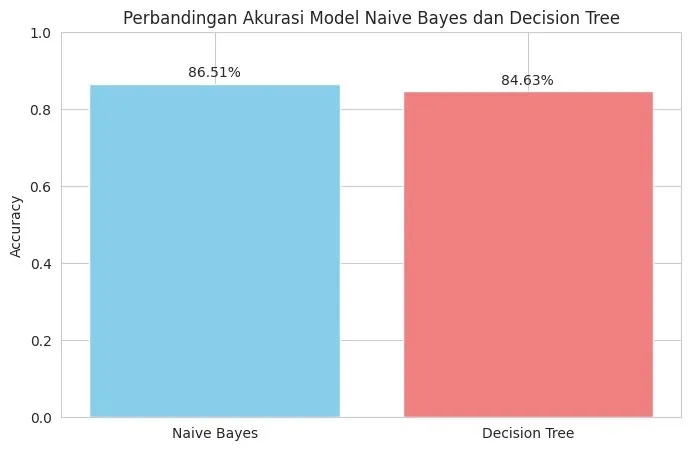
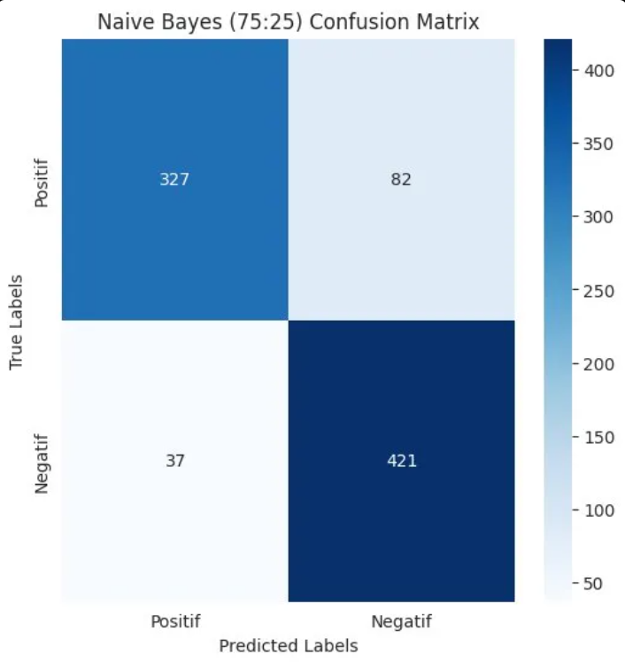
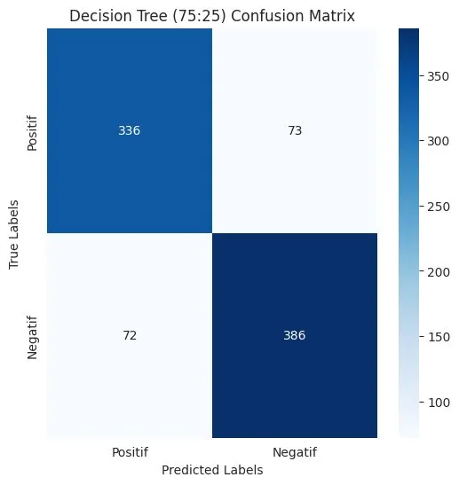
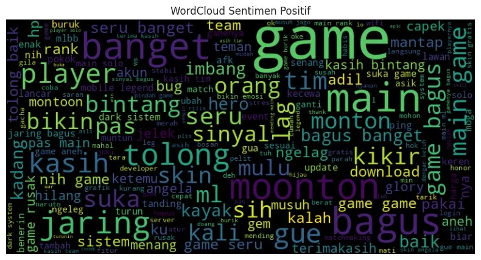
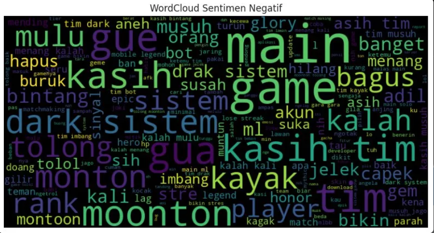

# 🎮 Analisis Sentimen Ulasan Google Play Store
## Aplikasi Mobile Legends: Bang Bang
### Menggunakan Naive Bayes & Decision Tree


---

## 📌 Tentang Project

Moonton menerima jutaan ulasan di Google Play Store setiap 
harinya — mustahil dibaca satu per satu secara manual.

Project ini membangun sistem **analisis sentimen otomatis** 
yang mengklasifikasikan ulasan pengguna Mobile Legends 
menjadi dua kategori:

- ✅ **Positif** → ulasan yang menunjukkan kepuasan
- ❌ **Negatif** → ulasan yang menunjukkan keluhan

Dua algoritma dibandingkan untuk menemukan model terbaik
untuk dataset ini: **Naive Bayes** vs **Decision Tree**

---

## 📊 Dataset

| Keterangan | Detail |
|---|---|
| Sumber | Google Play Store |
| Aplikasi | Mobile Legends: Bang Bang |
| Metode | Web Scraping (google-play-scraper) |
| Periode | 5 Juni – 8 Juni 2025 |
| Total Awal | 5.375 ulasan |
| Setelah Preprocessing | 4.884 ulasan |
| Siap Analisis | 3.468 ulasan |
| Bahasa | Indonesia |

---

## 🔄 Alur Project
Scraping Data     → Ambil ulasan dari Google Play Store
↓
Preprocessing     → Cleaning, Case Folding, Normalisasi,
Tokenisasi, Stopword Removal, Stemming
↓
Labeling          → Klasifikasi sentimen dengan Lexicon InSet
↓
Split Data        → Rasio 80:20 / 75:25 / 70:30 / 60:40
↓
Modeling          → Naive Bayes & Decision Tree
↓
Evaluasi          → Akurasi, Precision, Recall, F1-Score
↓
Visualisasi       → Confusion Matrix, WordCloud, Grafik


---

## 📈 Hasil & Perbandingan Model

### Akurasi Keseluruhan
| Model | Rata-rata Akurasi |
|---|---|
| ✅ **Naive Bayes** | **86.51%** |
| Decision Tree | 84.63% |

### Perbandingan Per Rasio Data


### Confusion Matrix
| Naive Bayes | Decision Tree |
|---|---|
|  |  |

---

## 🔍 Insight dari WordCloud

| Sentimen Positif | Sentimen Negatif |
|---|---|
|  |  |

**Temuan utama dari sentimen negatif:**
- 🔴 **"lag"** → Masalah koneksi/server
- 🔴 **"dark system"** → Ketidakpuasan sistem reward
- 🔴 **"tim & matchmaking"** → Sistem matchmaking dianggap 
  tidak adil

---

## 🛠️ Requirements

```bash
pip install google-play-scraper
pip install Sastrawi
pip install pandas numpy matplotlib seaborn
pip install scikit-learn wordcloud nltk
```

---

## 🚀 Cara Menjalankan

**Jika ingin scraping data baru:**
1. Buka `notebook/sentiment_analysis_mobile_legends.ipynb`
2. Jalankan cell **Scraping Data** untuk ambil ulasan terbaru
3. Run All cell dari atas ke bawah

**Jika ingin langsung analisis:**
1. Pastikan file CSV sudah ada di folder `data/raw/`
2. Skip cell scraping
3. Run All cell dari preprocessing sampai akhir

---

## 📁 Struktur Folder
mobile-legends-sentiment-analysis/
│
├── data/
│   ├── raw/                    ← Data mentah hasil scraping
│   ├── processed/              ← Data setelah preprocessing
│   ├── lexicon/                ← Kamus kata & lexicon InSet
│   └── splits/                 ← Data train & test per rasio
│
├── notebook/
│   └── sentiment_analysis_mobile_legends.ipynb
│
├── results/                    ← Grafik & visualisasi
│
└── README.md

---

## 💡 Rekomendasi untuk Moonton

Berdasarkan hasil analisis:

1. **Perbaiki server Indonesia** — keluhan "lag" 
   mendominasi sentimen negatif
2. **Review sistem matchmaking** — sesuaikan algoritma 
   dengan MMR/rank player
3. **Monitor sentimen secara rutin** — retrain model 
   setiap sebelum/sesudah update besar

---

## 👤 Author

**Yusuf Putra Bintang Satria**
- GitHub: [@YusufPutraBintangSatria](https://github.com/YusufPutraBintangSatria)
- LinkedIn: [Yusuf Putra Bintang Satria](linkedin.com/in/bintang-satria-data)

---

## 📚 Referensi

- [InSet Lexicon](https://github.com/fajri91/InSet) 
  by Fajri Koto
- [google-play-scraper](https://github.com/JoMingyu/google-play-scraper)
- [PySastrawi](https://github.com/har07/PySastrawi)
